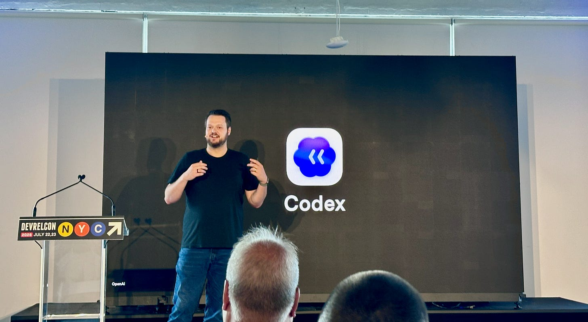
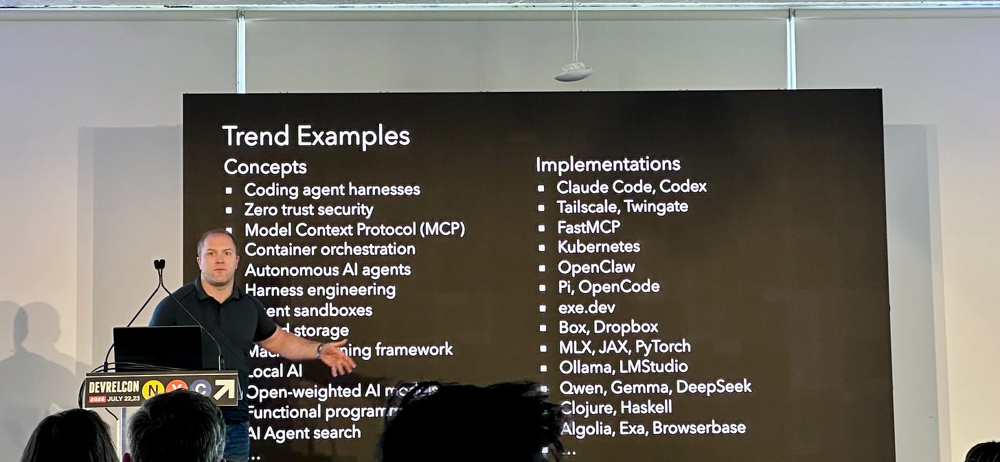
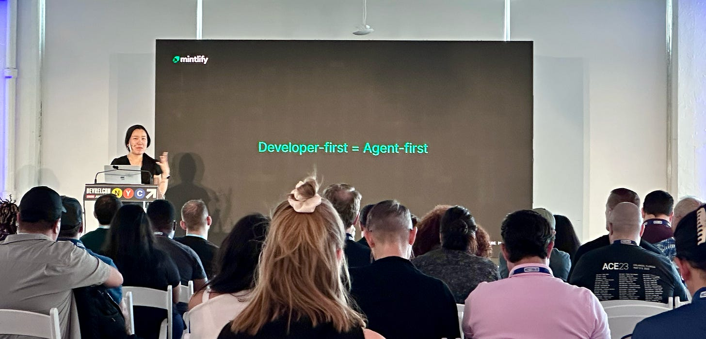
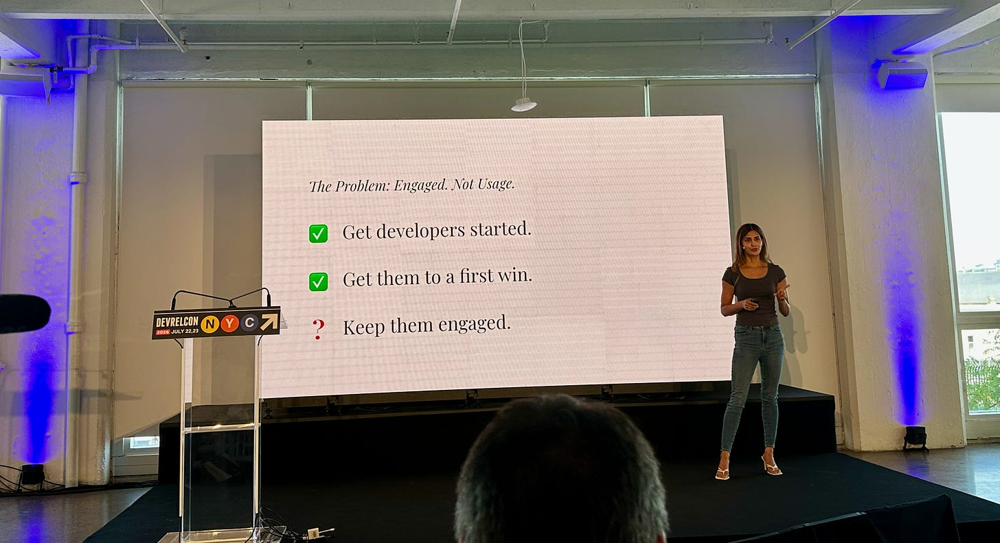
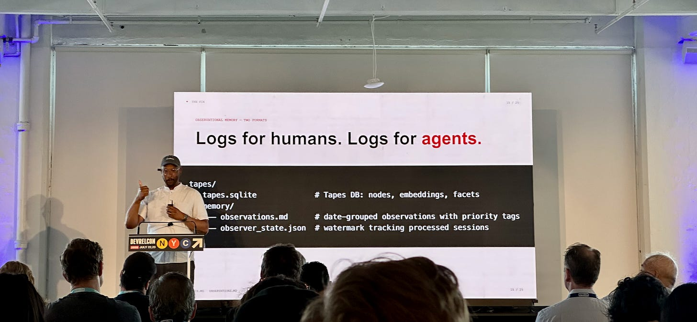
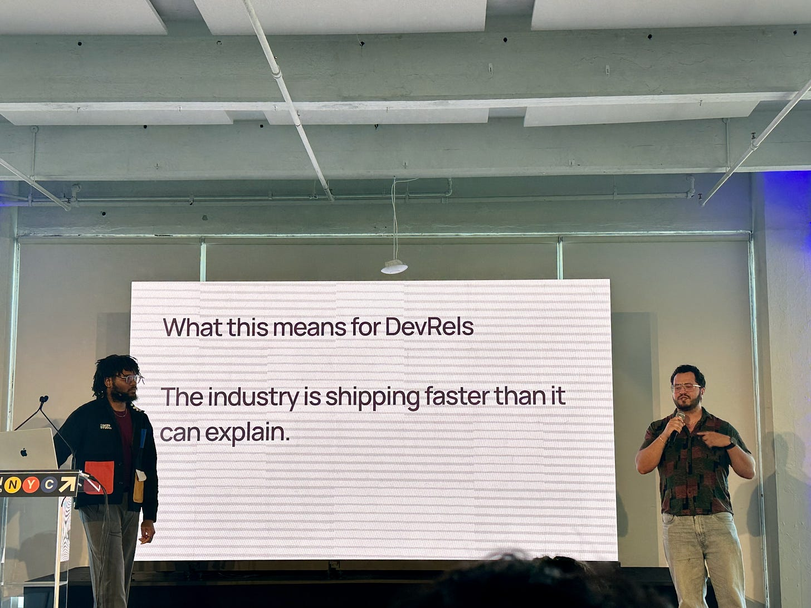
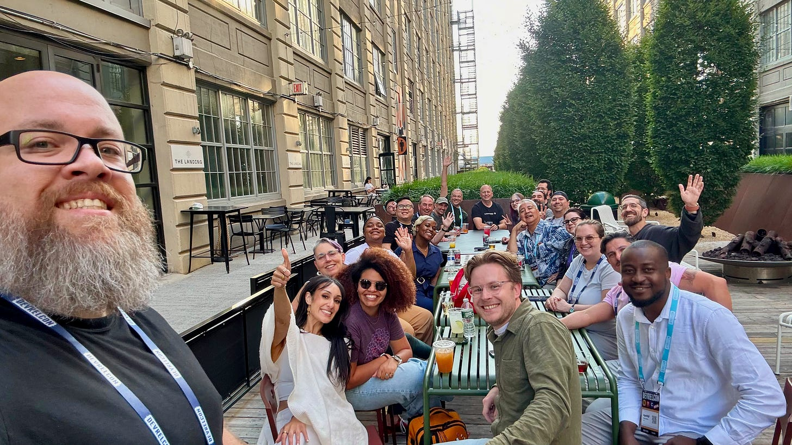
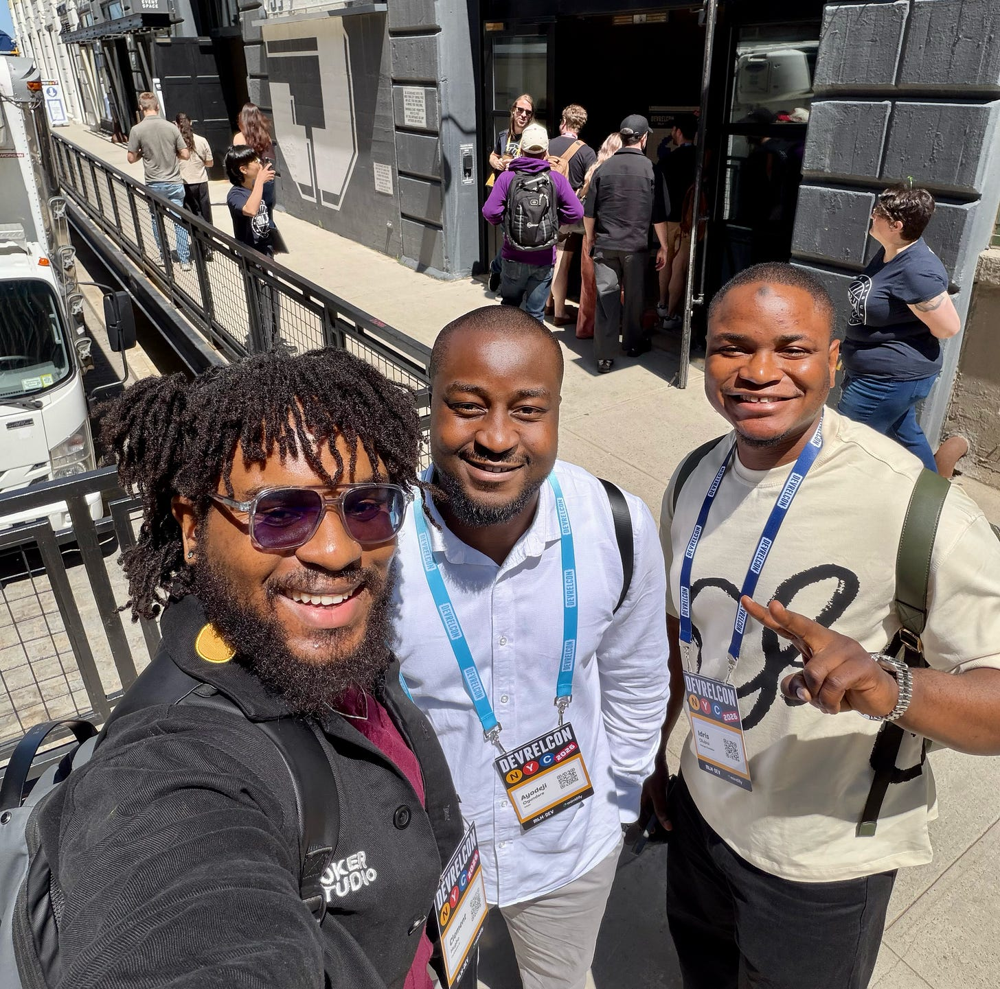
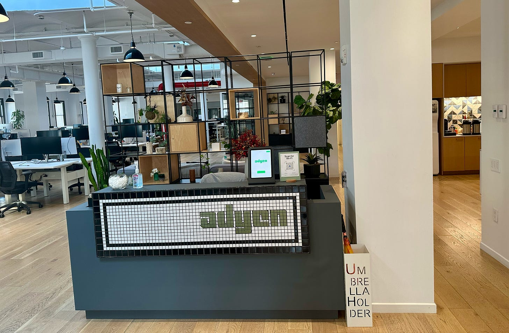

*tl;dr: DevRelCon New York 2026 made one thing clear: Developer Relations is not disappearing, but its audience, interfaces, and measures of success are changing. We now have to design experiences for both humans and AI agents, help a much broader group of builders succeed, and connect our work more clearly to products and business outcomes. At the same time, the qualities that make DevRel human empathy, trust, taste, teaching, and community have never mattered more.*

I left **[DevRelCon New York](https://nyc.devrelcon.dev/)** 2026 thinking less about whether AI will change Developer Relations and more about what kind of Developer Relations we want to build because of it.

Across two packed days, the conversations moved well beyond “How can DevRel use AI?” The more useful questions were deeper:

- What happens when an AI agent becomes a primary consumer of your documentation and APIs?
- What does developer experience mean when many builders do not identify as developers?
- How do we measure whether people actually build and ship, rather than simply view, click, or complete?
- Which parts of DevRel should become automated, and which parts become more valuable because they remain human?

There were no simplistic answers, which I appreciated. Instead, the conference offered a set of ideas, experiments, and challenges that together pointed toward a new operating model for DevRel.

## First, a New York recommendation

In my recap last year, I recommended the Apollo bagels. This year, my New York food recommendation is **[Quality Meats](https://www.qualitymeatsnyc.com/)**. If you love steak and find yourself in the city, it is worth trying. The name is very direct, and thankfully, so is the experience: good steak, good atmosphere, and a very enjoyable meal:)

*A street scene in New York City.*

## **DevRel’s audience is getting much bigger**

One of the strongest themes of the conference was the expansion from ***developers*** to ***builders***.

**[Dominik Kundel](https://www.linkedin.com/in/dkundel/)**‘s session, **“Evolving DX at the Speed of Frontier AI,”** described a world in which software creation is no longer limited to people with traditional engineering backgrounds. Developers are orchestrating multiple agents, while people in marketing, operations, agriculture, and many other fields are using AI to create tools and automate their work.

*Dominik Kundel presenting on “Evolving DX at the Speed of Frontier AI.”*

**[Jess Lee](https://www.linkedin.com/in/jessleenyc/)** and **[Mike Swift](https://www.linkedin.com/in/theycallmeswift/)** made a similar point in their session, **“DevRel Is Dead. Long Live DevRel.**” The title was not really a funeral announcement:) It was an argument that DevRel’s potential audience could grow from tens of millions of professional developers to hundreds of millions or even around a billion people who can build with software.

That is an enormous opportunity, but it also creates a responsibility.

For years, many developer programs have assumed a shared vocabulary: APIs, SDKs, terminals, authentication, environments, deployments, and repositories. That assumption becomes fragile when the person building a solution does not think of themselves as a software developer and may be working primarily through natural language.

This does not mean technical developers become less important. It means our experience has to work at more levels. We still need precision, depth, and composability for experts. We also need clearer paths for new builders who arrive with a goal but not necessarily the vocabulary or mental model of our product.

As Developer Advocates, we will need to become even better at progressive disclosure: helping someone get started without hiding the depth they will eventually need.

**[Matthew Makai](https://www.linkedin.com/in/matthewmakai/)**’s session added a useful personal dimension to this change. His framework was to explore a trend hands-on in the short term, calibrate your experience against trusted community signals in the medium term, and look for evidence of durable adoption over the long term. In a cycle where new tools arrive every week, learning how to evaluate a trend may be more valuable than attempting to chase every one.

*Matthew Makai presenting a framework for evaluating technical trends.*

## **Developer-first increasingly means agent-first**

The second major shift is that the user of your developer experience may not be a person reading one page at a time.

**[Hahnbee Lee](https://www.linkedin.com/in/hahnbee-lee/)**’s session made this shift concrete. AI agents are already responsible for a significant share of documentation traffic. They retrieve, interpret, and act on technical information differently from humans. Kevin Whinnery’s session also explored the same problem from the API side: agents need reliable tools, typed interfaces, current examples, and focused instructions if we want them to use our products correctly.

This changes what “good documentation” means.

Documentation written for a human can depend on visual hierarchy, implied context, or the reasonable expectation that a reader visited the previous page. An agent may retrieve a fragment without any of that context. A beautifully written page can still produce a poor result if its purpose, prerequisites, limitations, and decision criteria are not explicit.

**[Danielle W](https://www.linkedin.com/in/dwashington-clouddani/)** captured this well in her session. A knowledge base tells someone what exists. A decision system helps them understand what to do next, for which use case, and why.

An agent-ready content strategy should not mean adding more pages or placing an “AI” label on existing documentation. It should mean improving the information architecture itself:

- State the user’s intent and the job a page helps them complete.
- Make prerequisites and constraints explicit.
- Explain when to choose one approach over another.
- Include complete, tested examples.
- Structure content so that useful fragments retain their meaning when retrieved independently.
- Treat agent instructions and skills as maintained product surfaces, much like SDKs.

The interesting part is that these improvements also make documentation better for people. Clear intent, better structure, accurate examples, and explicit trade-offs are not agent-only requirements. Agent readiness can become a useful forcing function for better developer experience overall.

## **The first mile still decides whether developers ship**

AI may be changing how people write software, but several talks reminded us that familiar developer-experience problems have not disappeared.

**[Ojus Save](https://www.linkedin.com/in/ojus/)**’s workshop, **“What Makes Developers Actually Ship?”**, focused on friction in the first mile. The research presented covered hundreds of platforms and thousands of onboarding steps, gates, and blockers. One particularly memorable example showed how very few people completed an onboarding flow when confronted with confusing steps and interface problems.

That is a useful reminder: interest is not adoption, a signup is not activation, and a successful quickstart is not necessarily a shipped project.

**[Nikita Jotwani](https://www.linkedin.com/in/nikitajotwani/)** developed this idea further in the session **“DevRel for a Developer You’ll Never Hear From.”** Many of the developers we need to help will never attend an event, join our Discord, mention us on social media, or file a support ticket. Their struggle appears indirectly through abandoned workflows, repeated documentation searches, product telemetry, and patterns in community questions.

*Nikita Jotwani presenting on the challenges of keeping developers engaged beyond initial onboarding.*

To understand those developers, DevRel has to triangulate signals across the whole journey. Community data alone is incomplete. Product analytics alone often lack intent. Documentation analytics tell us what people viewed, but not always whether it solved their problem. Together, these signals can reveal where expectations and reality diverge.

This is an area where Developer Advocates can have significant impact. Our role is not only to create another tutorial for a visible symptom. It is to connect evidence across teams, identify the underlying system problem, and influence the product, documentation, tooling, and onboarding experience together.

## **Activity is not the same as impact**

The need for better measurement appeared repeatedly across the conference.

**[Joey de Villa](https://www.linkedin.com/in/joeydevilla/)** ’s session was direct about the pressure DevRel teams face. Organizations increasingly expect us to explain how our work contributes to adoption, revenue, retention, ecosystem health, or another meaningful business result. Counting activities without connecting them to outcomes will not be enough.

**[Sean Keegan](https://www.linkedin.com/in/seanryankeegan/)**’s session provided an excellent education-focused example. Badges can motivate someone to begin, but a completed module does not prove that a learner can apply the skill. Most technical content concentrates on remembering and understanding. Real learning becomes visible when people can apply, analyze, and create.

The practical implication is to pair consumption metrics with evidence of building:

- Did a learner deploy a component?
- Did they make a successful API call?
- Did they fork a repository or submit a pull request?
- Did they return to build something without being prompted?
- Did an onboarding journey reach a meaningful product milestone?

This does not make page views, attendance, completions, or community growth useless. Those remain valuable leading indicators. The mistake is treating them as the final result.

The more strategic question is: *What changed because this DevRel work existed?*

That question can be uncomfortable, especially because DevRel rarely controls the entire customer journey. But it is also how we earn influence. We can define the contribution our work makes, instrument it responsibly, and partner with Product, Marketing, Sales, Education, and Engineering on shared outcomes.

## **Agents need memory; organizations do too**

**[Brian Douglas](https://www.linkedin.com/in/brianldouglas/)**’s session explored agent memory, session recording, reusable context, specialized skills, and parallel experimentation. The technical examples were interesting, but I found the broader lesson just as relevant to organizations.

*Brian Douglas discussing agent memory and the importance of session recording.*

Teams repeat work when they fail to retain the context behind previous decisions. We write another prompt, investigate the same issue, recreate an environment, or relearn why an approach failed. Agents experience a similar problem when every task begins without useful history.

Brian’s emphasis on capturing sessions, extracting reusable knowledge, and retiring outdated instructions points toward a better model for team learning. The goal is not to save everything forever. It is to turn experience into maintained context that improves the next attempt.

**[David Crawshaw](https://www.linkedin.com/in/crawshaw/)**’s session extended that idea into development infrastructure. Agents can work in isolated environments, investigate CI failures, maintain personal software, and take on parallel tasks. However, useful autonomy depends on careful boundaries: scoped credentials, observable behavior, review processes, and a willingness to refine instructions through repeated use.

**[John Britton](https://www.linkedin.com/in/johndbritton/)**’s session reinforced the importance of composability. Agent systems need tools that are useful on their own, explicit about what they do, and flexible enough to combine into larger workflows. The future is not simply about asking a model to solve everything; it is also about giving that model dependable building blocks.

The lesson was not “hand everything to an agent.” It was that agentic workflows become valuable when the surrounding system is thoughtfully designed.

## **Trust and taste are becoming product requirements**

As the cost of generating content and software falls, judgment becomes more visible.

**[Kurtis Kemple](https://www.linkedin.com/in/kurtiskemple/)**’s session on **Agentic Experience Design** focused on trust. Users quickly reject AI systems that override their intent, behave unpredictably, or make it difficult to understand and correct their actions. A good agentic experience needs boundaries, transparency, and steerability. The human should retain intent and judgment, even when an agent handles planning and execution.

**[Juan Pablo Flores Cortés](https://www.linkedin.com/in/juanpflores94/)** and **[Clement Hugbo](https://www.linkedin.com/in/codemathics/)** approached the issue through **“Reflections on Taste.”** Taste is not simply visual polish. It is the quality of the choices we make: what we emphasize, what we leave out, whose needs we consider, what stories we tell, and what standards we refuse to lower.

*Juan Pablo Flores Cortés and Clement Hugbo presenting on the importance of taste in content creation.*

Brian Douglas also warned against producing more “AI slop” using generation to increase volume without increasing value.

This is especially relevant for DevRel. It is now easy to generate ten variations of a tutorial, dozens of social posts, or a large collection of examples. But abundance without judgment creates noise. Our audience still has to decide what to trust.

The durable advantage is not output volume. It is a recognizable point of view, technical accuracy, useful curation, honest limitations, and content shaped by real experience.

Taste also requires practice. People develop judgment by building, reviewing, failing, and trying again. If AI removes every difficult step too early, newcomers may produce more while getting fewer of the repetitions that help them recognize excellent work. Our education programs therefore need to use AI without eliminating the learning that builds independent judgment.

## **Community is infrastructure**

The conference was also a reminder that ecosystems are built through trust over time.

**[Lauren Lee](https://www.linkedin.com/in/lolocoding/)**’s session on **“Zero to Ecosystem”** shared the realities of growing a developer community around an unfamiliar technology. The most powerful parts were not growth hacks. They were examples of personal support, operational honesty, and publicly acknowledging when a program had gone wrong. Trust survived because integrity mattered more than pretending everything had worked.

**[Dawn Gibson Wages](https://www.linkedin.com/in/dawnwages/)** and **[Laís Carvalho](https://www.linkedin.com/in/laisbsc/)** offered a practical view of champion programs: start with a clear purpose, distinguish between users and customers, create manageable incentives, build the operational and legal foundation, and connect the program to feedback that can influence the product.

**[Lisa Tagliaferri](https://www.linkedin.com/in/lisa-tagliaferri/)** and **[Beatriz Datangel Rodgers](https://www.linkedin.com/in/bzdata/)** made a complementary case for developer marketing rooted in education, useful storytelling, experimentation, and action. Marketing is not a four-letter word when it helps developers discover something relevant and gives them the confidence to succeed with it.

These sessions reinforced a principle I have seen throughout my career: community is not an audience that waits for announcements. It is a network of relationships, feedback, shared practice, and trust. It requires operational care as much as enthusiasm.

## **The hallway track was one of my favorite sessions**

Some of the most valuable conference moments did not happen on stage.

The conversations I had with people in the hallways, between sessions, and around the conference were incredibly insightful. We discussed how our teams are adapting, what is working, what still feels uncertain, and how the role of Developer Relations is changing inside different organizations.

*Group photo with DevRel peers outside the Landing area. Photo credit: Frédéric Harper.*

Those conversations offered something a recording cannot fully reproduce. You can ask a follow-up question, compare experiences, challenge an assumption, and discover that someone on another team is working through the same problem from a completely different angle.

**[Carter Rabasa](https://www.linkedin.com/in/carterrabasa/)**’s session on **“Touching Grass in the Age of Agents”** gave language to this. As AI intermediates more of the relationship between developers and products, DevRel risks losing direct contact with the people we serve. We cannot build empathy only from dashboards or agent traces. We still need to write code, speak with developers, attend local gatherings, listen to frustration, and experience the product ourselves.

*Group selfie featuring Clement, Ayodeji, and Idris.*

In-person events matter not despite the rise of AI, but partly because of it. The more time we spend interacting through machines, the more valuable thoughtful human contact becomes.

## **What I am taking back to my work**

After reflecting on the sessions and conversations, these are the principles I want to carry forward:

1. Design one experience for humans and agents: Agent-ready and human-friendly should not become competing strategies. Structured context, explicit decisions, accurate examples, and reliable tools improve both.
2. Start with developer intent: Organizing everything around product features is convenient for companies, but developers arrive with goals. Content, onboarding, and navigation should begin with what they are trying to accomplish.
3. Measure successful building: Reach and engagement matter, but I want to connect them more consistently to activation, shipped projects, retained usage, ecosystem contribution, and other evidence that someone became successful.
4. Preserve the feedback loop: If an agent increasingly sits between a developer and a platform, we need new ways to learn where the experience fails. Product signals, documentation behavior, community conversations, support patterns, and direct research all need to inform one another.
5. Use AI to deepen the work, not merely multiply it: The goal is not to publish more because we can. It is to investigate faster, personalize responsibly, maintain examples, identify gaps, test assumptions, and create more room for high-value human judgment.
6. Keep showing up in person: Hallway conversations, shared meals, local meetups, and honest peer discussions remain essential. Community cannot be fully automated because trust cannot be reduced to a workflow.

## **A quick opportunity for builders**

*The reception area of the Adyen New York office.*

Before I wrap up: Adyen is currently hiring across our Chicago and San Francisco teams, including opportunities in technology. If the challenges explored in this post building reliable platforms, improving developer experience, and helping businesses grow sound interesting to you, take a look at the current roles on the **[Adyen careers page](https://careers.adyen.com/vacancies)**.

## **Final thoughts**

DevRelCon New York 2026 did not convince me that DevRel is dead. It convinced me that a narrower version of DevRel is becoming insufficient.

If our work is limited to publishing content, organizing events, or reporting engagement numbers, AI and changing business expectations will put pressure on it. But if DevRel helps an organization understand builders, improves the path to successful adoption, equips both humans and agents, strengthens the product feedback loop, teaches people to create, and builds trusted communities, then the function becomes more central, not less.

The interfaces are changing. The audience is expanding. The tools are moving quickly. Yet the core of the work remains familiar: understand people, reduce friction, explain complexity, create confidence, and help someone turn an idea into something real.

Big thanks to Mike Swift and the **[Major League Hacking](https://www.linkedin.com/company/major-league-hacking/)** team, as well as the sponsors, for putting this together.

#DevRel #DevRelCon #DevX #OpenSource #DeveloperCommunity
