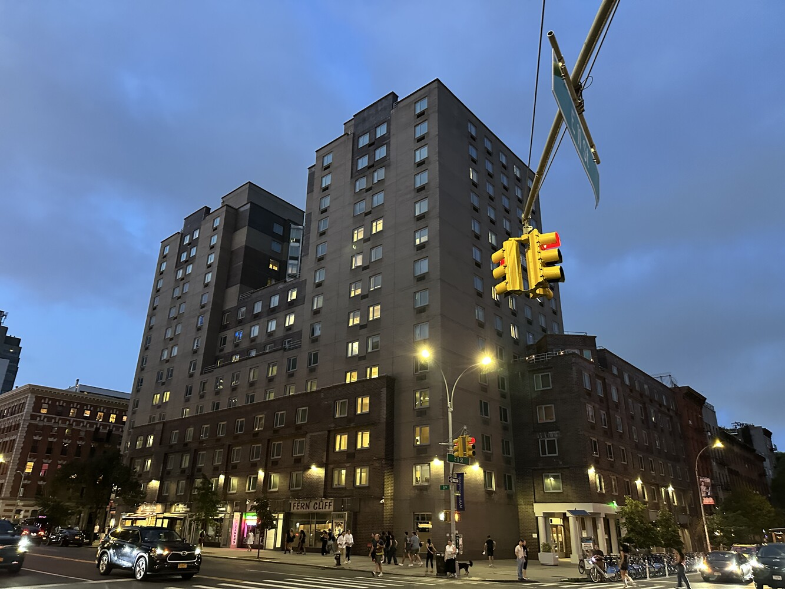
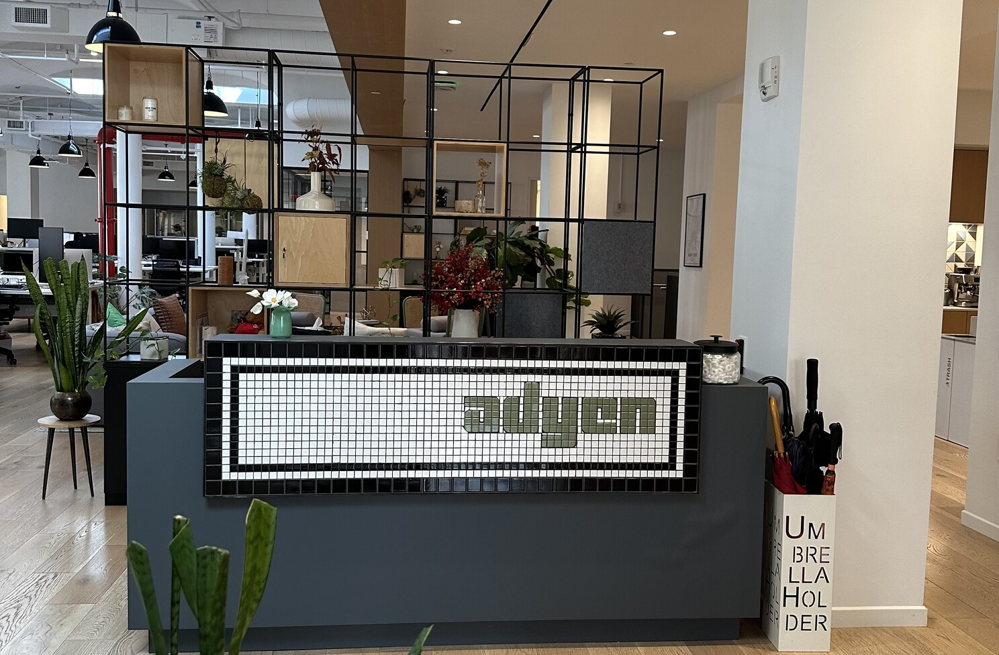

***tl;dr*** *\- I attended DevRelCon New York 2025, reconnecting with the DevRel community through insightful talks, real conversations, and shared experiences. From standout sessions on AI and storytelling to casual hallway chats and a creative magic show, the event delivered both value and connection.*

## **Arrival and Settling In**

I travelled from Amsterdam to New York with my colleague and fellow Developer Advocate, [Kwok He Chu](https://www.linkedin.com/in/kwokhechu). We arrived a couple of days before the conference to get settled and adjust to the time difference. The jet lag hit hard, but we powered through.

This wasn’t my first time in New York, so I already had a few favorite spots in mind. The food scene remains strong; every meal was on point. I did not have any bad food. I hope this perfect streak continues 😄. [**Apollo Bagels**](https://www.apollobagels.com/) was a standout this time around. Highly recommend if you’re nearby.

We worked from the [**Adyen**](https://adyen.com) New York office for a few days. It has a great rooftop view 🤩. It was also good to catch up with the New York team in person again.

## **Pre-Conference Connections**

On Wednesday, July 16, before the main event began, we attended the speaker and sponsor reception. These pre-conference gatherings are always a highlight for me. It’s a rare chance to connect with speakers and DevRel folks away from the stage, without the pressure of being “on.”

We had casual conversations about our upcoming talks, current projects, open source, developer relations, and what we’re seeing in the developer communities we work with. I always appreciate these moments of peer connection, sharing ideas, learning what others are trying, and just enjoying the company of people who understand the work.

## **Day 1 Highlights**

Day 1 started strong with a keynote from the legendary [Angie Jones](https://www.linkedin.com/in/angiejones/). She spoke about how core DevRel skills, such as storytelling, empathy, and technical translation, have helped her lead AI adoption at scale. Her talk set the tone, practical and grounded in real experience.

*Image: Photo of Angie Jones on stage*

After the keynote, we moved into breakout sessions. With so many good talks happening at the same time, I wish to split myself into three 😄. While I couldn’t attend everything, here are some standout sessions I joined:

* [**Uttam Tripathi**](https://www.linkedin.com/in/uttamtripathi/) shared practical insights on making Developer Relations (DevRel) more effective in the AI era. His talk included real-world examples of using AI to support developers and enhance workflow efficiency.

*Image: Photo of Uttam on stage*

* [**Anna Filippova**](https://www.linkedin.com/in/annafilippova/) focused on proactive storytelling. She shared ways to communicate the business impact of DevRel in a clear and meaningful manner.

*Image: Photo of Anna on stage*

* [**Greg Baugues**](https://www.linkedin.com/in/gregbaugues/) talked about starting and growing a developer-focused YouTube channel. He walked us through ideation, scripting, editing, and audience growth, with lots of actionable tips.

*Image: Photo of Greg on stage*

* [**Stephen Chin**](https://www.linkedin.com/in/steveonjava/) introduced a developer-first funnel that connects technical engagement to broader business goals. It was a solid framework for DevRel teams trying to align with business metrics.

*Image: Photo of Stephen on stage*

* **Anthony Dellavecchia** gave one of the most creative talks of the day. He broke down how to deliver product demos that stick using surprise, narrative, and clear value instead of just features.

*Image: Photo of a page from Anthony's slide*

The day ended with a hands-on keynote by [**Paige Bailey**](https://www.linkedin.com/in/dynamicwebpaige/). She demonstrated how to utilize tools like Gemini APIs and AI Studio to enhance DevRel workflows, including content creation, code samples, and more. It was practical and relevant, especially with the growing role of AI in our work.

*Image: Photo of Paige on stage*

## **Day 2 Highlights**

Day 2 opened with an inspiring keynote by [**Ricky Robinett**](https://www.linkedin.com/in/rickyrobinett/) titled *“****Steering Established Developer Ecosystems to New Heights****.”* He spoke directly to DevRel leaders working in mature developer communities. His focus was on building trust, identifying high-impact opportunities, and refining programs without compromising their effectiveness. Straightforward, focused, and easy to relate to.

*Image: Photo of Ricky on stage*

Here are a few more talks that I attended on day 2:

* [**Dominic Nguyen**](https://www.linkedin.com/in/domyen/) shared real-world strategies for running an effective Developer Relations (DevRel) program. He drew lessons from his work on Apollo GraphQL and StorybookJS, emphasizing substance over hype and outcomes over activity.

*Image: Photo of Dominic on stage*

* [**Erica**](https://www.linkedin.com/in/hansonerica/) **Hanson**’s talk was one of my personal favorites. Her work in Google Developer Groups influenced my journey into DevRel. She shared honest, practical insights on building and scaling developer communities, whether inside a global company like Google or a startup like Flutterflow. Her experience showed how to start from scratch, build engagement, and adapt across different environments.

*Image: Photo of Erica on stage*

* [**Pj Metz**](https://www.linkedin.com/in/metzinaround/) brought a great deal of energy to his session. He shared lessons from managing GitHub’s Campus Experts program. His talk provided clear takeaways on working with student communities that can easily be applied to broader DevRel efforts.

*Image: Photo of Pj on stage*

## **The Magic Show**

Yes, there was a magic show. Ricky and Greg closed out the day with a fun, unexpected performance that pulled the crowd in. To make it even better, they went ahead and shared the secrets and tricks behind the magic, as well as resources on how to get started. It was playful and memorable, a perfect way to wrap up two packed days.

*Image: Photo of Magic Show Slide*

## **My Top 5 Takeaways**

1. **The content playbook is shifting:** Developer content now needs to serve both humans and LLMs. Structure, clarity, and context matter more than ever.

2. **Context is everything:** LLMs can mislead when context is missing or outdated. Model Context Protocols (MCP) provide a path to more accurate and helpful experiences for developers.

3. **DevRel’s role in AI adoption is critical:** We’re in a unique position to guide developers on using AI effectively through documentation, demos, content, and community.

4. **Storytelling still wins:** Across almost every session, one theme came up repeatedly: straightforward storytelling makes DevRel work stand out, whether you’re building community, teaching tools, or driving product adoption.

5. **In-person connections matter:** From hallway chats to shared meals, face-to-face time with other DevRel professionals adds depth that you can’t get online. These moments are often where the real insight and inspiration happen.

## **The People**

One of the best parts of DevRelCon was the people. It was great to reconnect with familiar faces and meet new folks doing meaningful DevRel work across different roles and companies.

*Image: ACW for Right - Vishal, Angie, Anthony, Kwok, Ayodeji*

Conversations flowed during breaks, hallway chats, and spontaneous group lunches. Whether we were discussing content strategy, open source, developer experience, community challenges, or simply swapping stories from the field, the energy was palpable.

These kinds of in-person moments build trust and spark new ideas. They remind me why community is at the core of what we do.

## **The Opportunities**

One thoughtful addition at DevRelCon was the community job board. Attendees hiring for DevRel, Developer Experience, or related roles pinned open positions using sticky notes or printed cards with job titles, company names, and contact details. On the other side, folks open to new opportunities posted their availability.

It created a casual, low-pressure way to connect around hiring. I snapped a photo of the board, which you’ll find below.

Feel free to zoom in to explore the listings or analyze the image with your favorite LLM tool if you're feeling curious. You might spot a lead worth following.

*Image: Job board at DevRelCon NY 2025*

## **Final Thoughts**

DevRelCon New York 2025 checked all the boxes for me. The talks were insightful, the conversations were honest, and the energy around the future of Developer Relations was strong.

Big thanks to **Mike Swift** and the Major League Hacking team, as well as the sponsors, for putting this together and creating space for these critical conversations. I’m leaving the conference with new ideas, fresh connections, and a clearer view of where DevRel is heading.

Looking forward to the next one.

## **Resources**

Here’s a helpful resource from the conference that I recommend checking out:

* **Slides**: [***Steering Established Developer Ecosystems to New Heights***](https://www.canva.com/design/DAGtJ2kTJ6Q/-0HMVklq_NcO_Wj_eLOGCQ/edit)

* **Slides:** [***Three Marketing Frameworks Every Developer Advocate Should Know***](https://developer.marketing/devrelcon/)

#DevRel #DevRelCon #DevX #OpenSource #DeveloperCommunity
