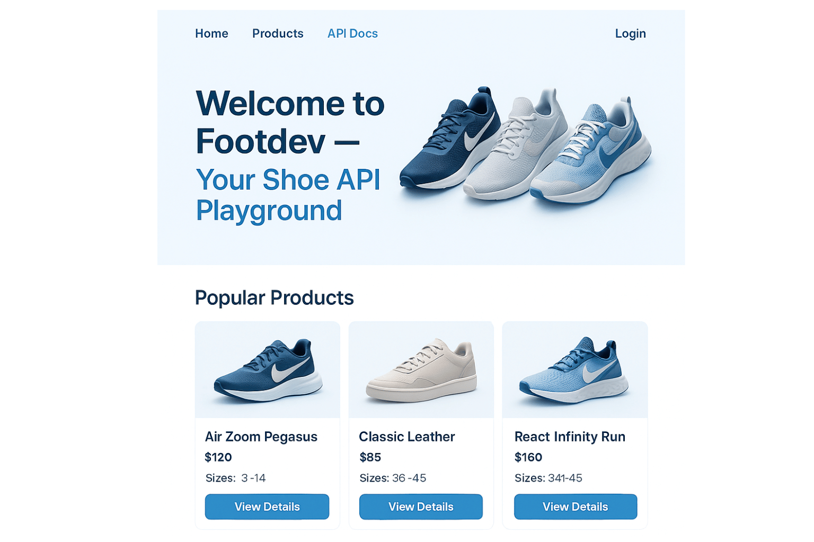
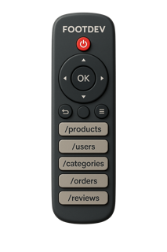
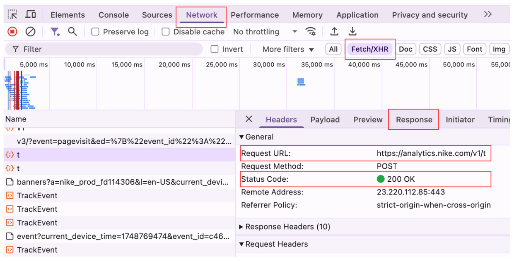
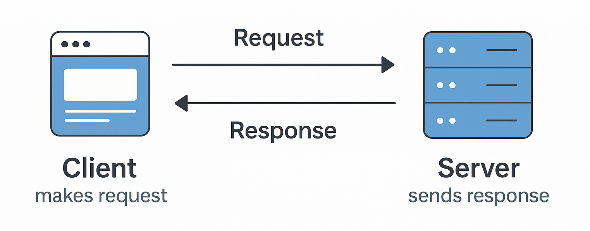
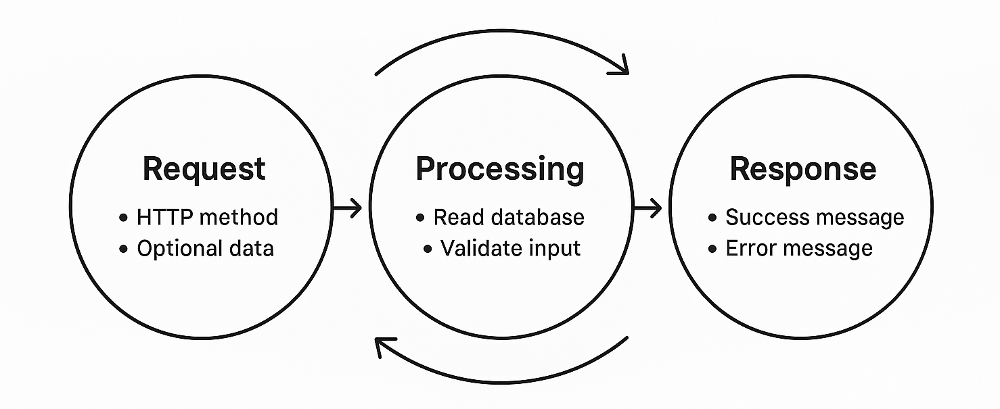
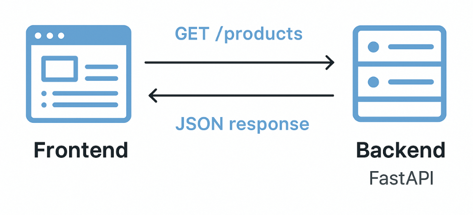
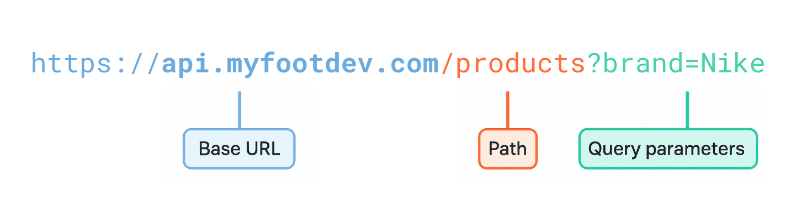

Welcome to this tutorial series on API development and documentation with **FastAPI**. By the end of the series, you’ll have built the backend API for a fictional online shoe store called **My Footdev Store**.

You’ll learn how to **design**, **build**, **test**, and **document** APIs using FastAPI - one of the fastest-growing web frameworks for Python developers. Each part of the series will guide you step by step, using real examples and hands-on exercises.

## What is FastAPI?

[FastAPI](https://fastapi.tiangolo.com/) is an open-source Python framework designed for building APIs quickly and easily. It was created by **Sebastián Ramírez** and released in 2018.


FastAPI is built on top of standard Python type hints, which means your API automatically receives validation, editor support (such as autocompletion), and robust documentation with minimal effort.

Due to its speed and ease of use, FastAPI has gained popularity in the Python community, quickly becoming the preferred framework for building APIs. It’s used by companies like Netflix, Microsoft, and Uber for production-grade services.

## What You’ll Build



Throughout the series, you’ll build a backend API that powers the Footdev store. The API will support features like:

* Listing and filtering shoes

* Viewing product details

* Registering users

* Managing shopping carts

* Checking out orders

You don’t need a frontend for now. We’ll focus purely on the API that a frontend or mobile app could connect to.

## What You’ll Learn in This Part

In this first part, you’ll get a foundation on what APIs are and how they work. You’ll learn:

* What APIs are and why they’re used

* How APIs communicate over the internet

* The basics of HTTP and REST

* How JSON is used for data exchange

* How to setup your development environment for a FastAPI project

### Prerequisites

This tutorial is for beginners, but you should be comfortable with the basics of:

* Python (variables, functions, basic data types)

* Using the terminal or command prompt

* Installing Python packages with pip

## **What is an API?**

An API (**Application Programming Interface**) enables two software systems to communicate with each other. It defines the rules for how one program can request data or trigger actions from another.

### Think of an API like a **TV remote control**



The remote has buttons that you can press to perform specific actions, such as changing the channel, adjusting the volume, or turning the TV on and off. You don’t need to know how the TV and remote work internally. You just need to know which buttons to press.

In the same way, an API gives you a set of “buttons” (**endpoints**) you can use to interact with a system. You send a request (such as pressing a button), and the system responds with a corresponding action (such as changing the channel).

### Real-World Examples of APIs

APIs are used everywhere, whether you’re checking the weather, making a payment, or getting directions. Here are a few real-world examples, along with actual APIs developers use to build those features:

**Weather App**
Weather apps use APIs to fetch up-to-date weather conditions based on your location.
**Example:**
The [OpenWeather API](https://openweathermap.org/api) provides current weather, forecasts, and historical data.

**Payments**
When you pay for something online, the site doesn’t process your card directly. It talks to a payment API to handle the transaction securely.
**Example:**
The [Adyen API](https://docs.adyen.com/api-explorer/) lets developers implement and manage a payments solution with a wide range of features, including online payments, subscriptions.

**Map and Location Services**
Ride booking or train schedule apps like Uber use APIs to fetch location data, calculate routes, and estimate arrival times.
**Example:**
The [Google Maps Directions API](https://developers.google.com/maps/documentation/directions) returns turn-by-turn routes based on origin and destination.

APIs are everywhere in your day-to-day interaction with the internet. They are the connection between software services. They help apps share data and perform actions without needing to know each other’s internal logic.

### Task: Inspect an API in Action

Let’s take a quick look at how real websites use APIs.



1. Visit any online store (like **Amazon.com** or **Nike.com**).

2. Open Developer Tools:

    * Right-click on the page &gt; **Inspect**

    * Or press Ctrl+Shift+I (Windows) / Cmd+Option+I (Mac)

3. Go to the **Network** tab.

4. Refresh the page and look for requests with **'XHR**' or **'fetch**' in the *Type* column.

5. Click on any one, you’ll see:

    * A **Request URL** (the endpoint)

    * A **Response** (usually JSON)

    * **Headers** and status codes

This is how APIs work in the background: a client (such as a browser or app) sends a request, and the server responds with the requested data.

Next, we’ll examine how this communication occurs over the internet.

## How APIs Work

Now that you understand what an API is, let’s look at how it works behind the scenes.

APIs enable two systems to communicate, typically a client and a server.

### Communication Between Client and Server



* The **client** is the part that makes the request. This could be a web browser, mobile app, or another backend system.

* The **server** is the part that receives the request, processes it, and sends back a response.

In our Footdev Store project, the backend you’ll build with FastAPI will act as the server. A web or mobile frontend (which you won’t build in this tutorial) would be the client.

### The Request, Process, Response Cycle



Every API interaction follows the basic flow below. Some of the terms may be new to you, but no worries, you will learn more in the following sections of this blog. Every time a client talks to an API, the interaction follows a simple three-step cycle:

**Step 1: Request**

The client (such as a browser or mobile app) sends a request to a specific **URL** (endpoint). This request includes:

* An HTTP method (e.g., `GET`, `POST`)

* Optional data (e.g., a search query or product info)

* Headers (e.g., authentication tokens)

**Example**

```http
GET /products?brand=Nike
```

This request asks the server for a list of Nike products.

**Step 2 Processing**

The server receives the request and decides what to do:

* It may **validate input** (e.g., check if the brand name is valid)

* It might **query a database** (e.g., get matching products)

* It can **apply business logic** (e.g., sort results, apply filters)

Everything happens behind the scenes—you don’t see this part, but it’s where the work happens.

**Step 3: Response**

Once the server finishes processing, it sends back a response to the client. This response usually includes:

* A status code (e.g., `200 OK`, `404 Not Found`)

* A response body (often JSON data)

You’ll build endpoints that follow this cycle in every part of this series.

### Overview of Frontend–Backend Relationship

The **frontend** is the user-facing part of an application. It makes requests when a user clicks a button, submits a form, or loads a page.

The **backend** like what we are building in this tutorial is the system that handles requests, which could involve fetching or saving data, and then sends a response back to the frontend.

APIs are the bridge between the two. They define how the frontend talks to the backend.

**Example**



* When a user visits the shoe catalog page on My Footdev Store, the frontend sends a `GET /products` request.

* Your FastAPI backend receives that request, fetches a list of shoes, and returns it as a JSON response.

In the next section, we’ll go deeper into the protocols that make all this communication possible.

## Internet Protocols and Data Formats

For APIs to function correctly, the client and server must share a common language and set of rules for exchanging information. That’s where internet protocols and data formats come in.

### What is HTTP?

**HTTP** stands for **HyperText Transfer Protocol**. It’s the protocol that powers most communication on the web.

When your browser requests a webpage or when an app calls an API, it’s using HTTP to send and receive messages.

Each HTTP request has:

* A **method** (what action to perform)

* A **URL** (where to send the request)

* Optional headers and body

Standard HTTP methods used in APIs:

* `GET` – fetch data

* `POST` – send data to create something

* `PUT` – send data to update something

* `DELETE` – remove data

You’ll use all of these while building the Footdev Store API.

### URLs and Endpoints

A **URL** (Uniform Resource Locator) is the address of a resource on the Internet. In APIs, each action typically has its own unique URL, referred to as an **endpoint**.

**Example**

```bash
curl GET https://api.myfootdev.com/products/?brand=Nike
```



An endpoint usually contains:

* A base URL (e.g., [https://api.myfootdev.com](https://api.myfootdev.com))

* A path (e.g., /products)

* Optional query parameters (e.g., ?brand=Nike)

### JSON as a Standard Data Format

APIs need a way to send and receive data between the client and server. The most common format for this is JSON, which stands for JavaScript Object Notation.

It’s a lightweight format that’s easy for both humans and computers to read and write. Most modern APIs—including the one you’ll build with FastAPI—use JSON for all communication.

#### Why JSON?

* It’s **simple**: uses key–value pairs, like Python dictionaries

* It’s **language-independent**: works with Python, JavaScript, and more

* It’s **structured**: supports nested objects and arrays

Here’s what a typical JSON object looks like:

```json
{
  "id": 1,
  "name": "Air Zoom Pegasus",
  "brand": "Nike",
  "price": 120.00,
  "sizes": [38, 39, 40, 41, 42],
  "inStock": true
}
```

JSON supports:

* Strings

* Numbers

* Booleans

* Arrays

* Nested objects

You’ll use JSON to define your API’s responses and also in your requests when creating or updating resources.

### **Task: Write a JSON Object**

Try writing your own JSON object to represent a shoe item for myfootdev.com. Use the following structure:

* `id`: a unique number

* `name`: the shoe name

* `brand`: the brand

* `price`: a number

* `sizes`: an array of available sizes

* `inStock`: true or false

Paste it into your code editor or an online JSON validator, such as [https://jsonlint.com](https://jsonlint.com/), to verify your syntax.

Next, we’ll look at how to design APIs using REST principles.

## RESTful APIs

Now that you understand how APIs work and how they communicate using HTTP and JSON, let’s explore a typical style of designing APIs: **REST**.

### What is REST?

**REST** stands for **Representational State Transfer**. It’s a set of rules for building APIs that are simple, predictable, and easy to use.

A **RESTful API** uses standard HTTP methods and treats everything as a **resource**, like a product, user, or order. Each resource has its unique URL and supports operations such as creating, reading, updating, and deleting. More on this later.

### Key REST Principles

RESTful APIs follow a set of design principles that make them predictable and easy to work with. These principles guide how clients interact with resources on the server.

1. **Stateless
    **Each API request is independent. The server doesn’t store session data or user context between requests. If a client needs to authenticate or send specific details, it must include them with every request.

2. **Resource-Oriented
    **The API is centered around resources (like `/products`, `/users`, `/orders`). Each resource is represented with a URL and interacts with specific HTTP methods.

3. **Use of HTTP Methods
    **HTTP methods describe what kind of operation you're performing on a resource. Each method pairs with an endpoint to define intent clearly.

### Common HTTP Methods with Examples

<table><tbody><tr><td colspan="1" rowspan="1" colwidth="200"><p><strong>Method</strong></p></td><td colspan="1" rowspan="1" colwidth="200"><p><strong>Action</strong></p></td><td colspan="1" rowspan="1"><p><strong>Example Endpoint</strong></p></td><td colspan="1" rowspan="1"><p><strong>Description</strong></p></td></tr><tr><td colspan="1" rowspan="1" colwidth="200"><p>GET</p></td><td colspan="1" rowspan="1" colwidth="200"><p>Read data</p></td><td colspan="1" rowspan="1"><p><code>GET /products</code></p></td><td colspan="1" rowspan="1"><p>Fetch a list of products</p></td></tr><tr><td colspan="1" rowspan="1" colwidth="200"><p>POST</p></td><td colspan="1" rowspan="1" colwidth="200"><p>Create new data</p></td><td colspan="1" rowspan="1"><p><code>POST /products</code></p></td><td colspan="1" rowspan="1"><p>Add a new product</p></td></tr><tr><td colspan="1" rowspan="1" colwidth="200"><p>GET</p></td><td colspan="1" rowspan="1" colwidth="200"><p>Read single item</p></td><td colspan="1" rowspan="1"><p><code>GET /products/1</code></p></td><td colspan="1" rowspan="1"><p>Get details of product with ID 1</p></td></tr><tr><td colspan="1" rowspan="1" colwidth="200"><p>PUT</p></td><td colspan="1" rowspan="1" colwidth="200"><p>Update data</p></td><td colspan="1" rowspan="1"><p><code>PUT /products/1</code></p></td><td colspan="1" rowspan="1"><p>Update product with ID 1</p></td></tr><tr><td colspan="1" rowspan="1" colwidth="200"><p>DELETE</p></td><td colspan="1" rowspan="1" colwidth="200"><p>Delete data</p></td><td colspan="1" rowspan="1"><p><code>DELETE /products/1</code></p></td><td colspan="1" rowspan="1"><p>Remove product with ID 1</p></td></tr></tbody></table>

Each method corresponds to a specific type of operation, which makes RESTful APIs easy to understand and use.

In the next section, you’ll get your development environment ready and start setting up the My Footdev Store API project.

## Setting up for a FastAPI project

Before we write any code, let’s get your development environment ready. You’ll set up everything needed to start building the My Footdev Store API in the next part of the series.

### Tools

To practice the steps in this series, you’ll need:

* An internet connection (of course)

* **Python 3.11+** \- We’ll use the latest Python features supported by FastAPI.

* **A Code Editor** \- VS Code is recommended, but you can use any editor you prefer.

* **Terminal / Command Prompt** \- To run commands and manage the project.

### Folder and Project Structure

Start by creating a folder for the project. You’ll keep all your API code, configurations, and dependencies inside this folder.

```bash
mkdir myfootdev-api
cd myfootdev-api
```

As the project grows, it will look like this:

```plaintext
myfootdev-api/
├── app/
│   ├── main.py
│   ├── routes/
│   └── models/
├── tests/
├── requirements.txt
└── README.md
```

<div data-node-type="callout">
<div data-node-type="callout-emoji">ℹ</div>
<div data-node-type="callout-text">No need to create these folders now, you’ll create the full structure step by step in later parts of this series.</div>
</div>

### Installing Python 3.11+

Check your Python version:

```bash
python --version
```

or

```bash
python3 --version
```

If it’s below 3.11, download and install the latest version from [https://www.python.org/downloads/](https://www.python.org/downloads/).

### Creating a Virtual Environment

Use venv to create an isolated environment for your project:

For macOS/Linux

```bash
python3 -m venv venv
source venv/bin/activate
```

For Windows

```bash
python -m venv venv
venv\Scripts\activate
```

After activation, your terminal prompt should show (venv) at the beginning.

Now install FastAPI and Uvicorn (you’ll use them in the next part):

```bash
pip install fastapi uvicorn
```

You're ready to start building your first API. In the next part, you’ll build your first FastAPI app and learn how to handle HTTP requests and responses.

## Part 1 Wrap-Up

You’ve just completed the first part of this series on API development and documentation with FastAPI.

Here’s what you learned:

* What an API is and how it works

* How clients and servers communicate using HTTP

* The role of JSON in data exchange

* The principles behind RESTful APIs

* How to match real-world actions to HTTP methods

* How to set up your development environment with Python and FastAPI

You now understand the basics of how APIs function and how REST organizes them around resources and standard HTTP actions.

### What’s Next

In the next part, you’ll:

* Write your first FastAPI app

* Define your first API endpoints

* Send and receive HTTP requests

* Use tools like Postman and curl to test your API

It’s completely fine to revisit what you learned so far. When you’re ready, head over to the next part and start building the Footdev Store backend step by step.
